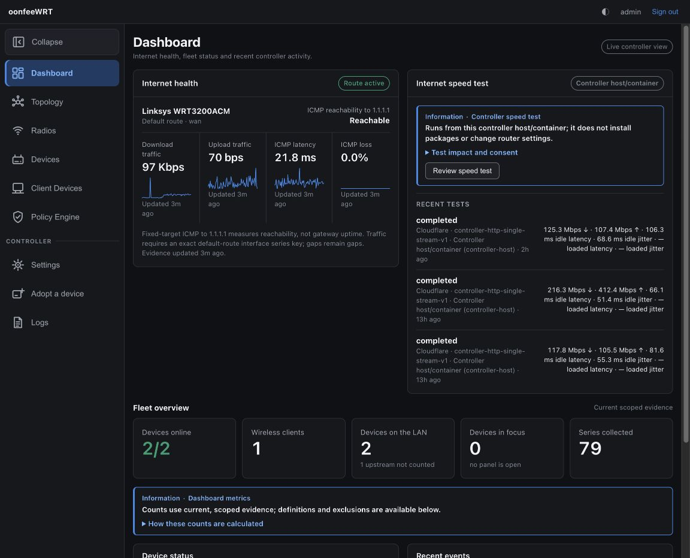
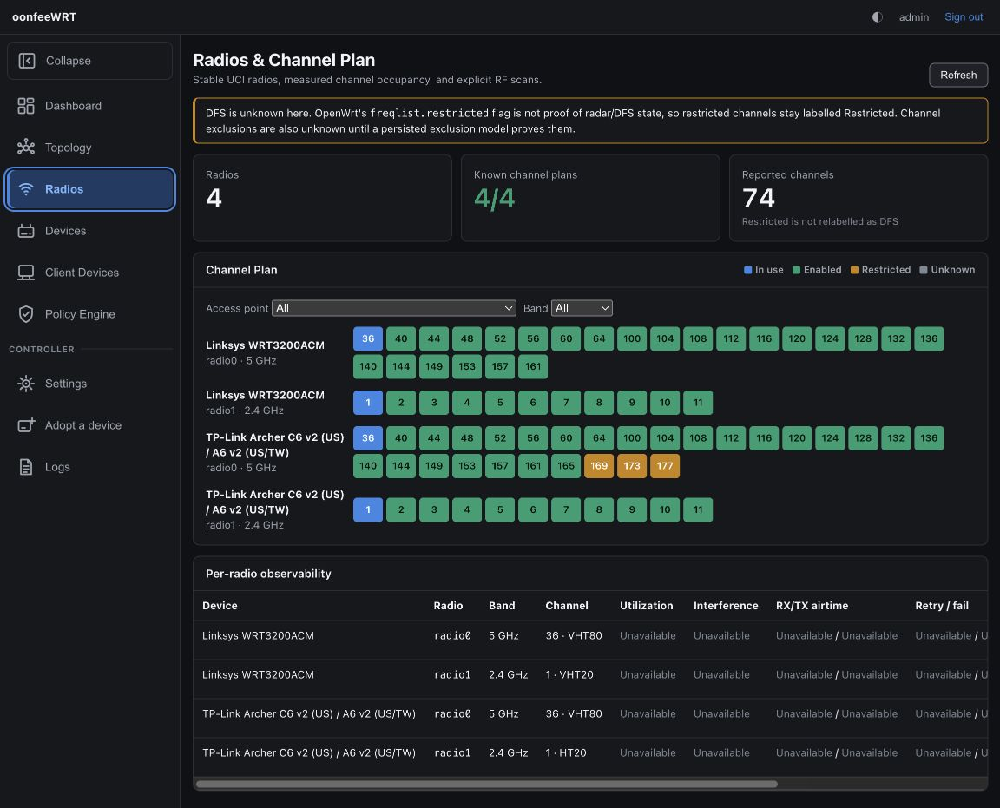

# oonfeeWRT

Self-hosted, UniFi-inspired management for stock OpenWrt.

[](https://github.com/aiden0rchad/oonfeeWRT/releases)
[](https://github.com/aiden0rchad/oonfeeWRT/actions/workflows/ci.yml)
[](LICENSE)

oonfeeWRT is a controller, not firmware. It runs on your server, NAS, mini-PC,
or Mac and manages OpenWrt devices through their existing interfaces. Your
routers stay on stock OpenWrt and continue to work with LuCI.

## Preview

[](docs/images/dashboard-overview.jpg)

*Live Internet health, controller-host speed tests, and fleet status.*

[](docs/images/radios-channel-plan.jpg)

*Live radio inventory and evidence-aware channel planning.*

## What it provides

- A fleet dashboard with WAN reachability, throughput, topology, clients,
  radios, events, and controller-host speed tests.
- Reviewed site configuration for networks, VLANs, DHCP, firewall zones, and
  WLANs, with OpenWrt's rollback timer protecting every Apply.
- Device adoption, health monitoring, telemetry, logs, RF tools, and explicit
  source-coverage gaps instead of guessed data.
- Local owner, administrator, operator, and read-only accounts with session
  management and revocation.
- Downloadable, redacted diagnostics bundles containing controller evidence and
  stored router model, firmware, and capability data.
- Encrypted controller backup and staged restore with compatibility checks,
  controlled restart, and a persistent router-write gate.
- Optional LLDP using the official OpenWrt `lldpd` package, with an exact plan,
  separate consent, durable ownership records, and rollback.

## Project boundaries

oonfeeWRT does not build or replace OpenWrt, run controller-authored software on
routers, broker cloud access, or silently install packages.

Adoption can create only one scoped `oonfeewrt` login and one rpcd ACL JSON
file after you approve the displayed plan. The router administrator credential
used for that one-time action is not stored. Optional packages and
configuration changes have separate review and consent flows.

The controller changes only UCI sections it owns. Existing human-managed
sections remain visible but are not silently rewritten.

## Quick start with Docker Compose

Requirements:

- Docker with Compose support.
- A controller host that can reach each router's management address.
- OpenWrt 21.02 or newer with SSH, `rpcd`, and the `uhttpd` ubus handler.

Create a private working directory and download the release Compose file:

```sh
mkdir -p oonfeewrt
cd oonfeewrt

curl --fail --location \
  --output docker-compose.yml \
  https://raw.githubusercontent.com/aiden0rchad/oonfeeWRT/v0.1.0/deploy/docker-compose.yml

umask 077
head -c 32 /dev/urandom | base64 > passphrase
sudo chown 65532:65532 passphrase
sudo chmod 600 passphrase

docker compose up -d
```

Open [http://127.0.0.1:8080](http://127.0.0.1:8080) and create the first owner
account. The default Compose configuration publishes HTTP only on host
loopback, runs as UID 65532, drops all capabilities, uses a read-only root
filesystem, and stores controller state in a named volume. It pulls
`ghcr.io/aiden0rchad/oonfeewrt:v0.1.0` for `linux/amd64` or `linux/arm64`.

The `passphrase` file unlocks the controller keyring and is not your owner
account password. Back it up with the controller state and keep both private.
`docker compose down -v` deletes the named data volume.

Bridge networking works on Linux and Docker Desktop. Layer-2 discovery does not
cross the bridge, so add routers by address. Linux host networking is an
explicit opt-in described in the Compose file.

For checksummed binaries, signature verification, reverse-proxy TLS,
persistence, upgrades, and rollback, follow the
[installation guide](docs/INSTALL.md).

## First adoption

1. Set a router root password if it does not already have one:

   ```sh
   ROUTER_ADDRESS=192.0.2.1
   ssh -t root@"$ROUTER_ADDRESS" passwd
   ```

   The controller warns rather than blocking an explicitly trusted,
   passwordless lab router. Do not rely on that outside isolated testing.

2. In **Devices**, add the router by address or run the on-demand discovery
   scan.
3. Review the controller-access payload. Approving it creates the scoped login
   and ACL; cancelling changes nothing.
4. Inspect discovered capabilities and source gaps.
5. Preview configuration before Apply. Router changes never happen merely
   because a device was discovered or listed.

## Safety model

- Apply uses `uci.apply` with a rollback window, then confirms only after the
  controller can read the expected state. An interrupted or unhealthy Apply
  reverts on the router.
- Ownership tags restrict changes and cleanup to controller-created sections.
- RF scans, speed tests, capability installation, and other disruptive actions
  require explicit acknowledgement.
- Un-adoption restores or removes controller-owned configuration, then removes
  the scoped login and ACL. It is blocked while an optional LLDP installation
  still has a rollback record.
- Restoring a controller never automatically applies restored desired
  configuration. Router writes remain suppressed until an owner reviews and
  explicitly resumes them.
- The HTTP listener has no native TLS. Keep it on loopback or an isolated
  management network, and use a trusted reverse proxy for remote access.

## Backup and diagnostics

Owners can use **Settings → Backup & Restore** to export an encrypted
`.oowrtbak` file. Export requires recent account reauthentication and a
separate passphrase that the controller does not retain. Restore decrypts and
validates in disposable staging, shows a compatibility preview, creates a
safety backup, and completes through a controlled restart.

For filesystem-level recovery, `oonfeewrt.db` and `keyring.json` are one
unit. The runtime passphrase cannot recreate a lost keyring. See the
[installation guide](docs/INSTALL.md#back-up-and-upgrade) before copying live
state.

Diagnostics bundles are bounded, redacted ZIP files generated from stored
controller evidence. They make no router management call and exclude
credentials, WLAN keys, private keys, session material, and controller
passphrases.

## Current limitations

- Hardware validation covers a Linksys WRT3200ACM and TP-Link Archer C6 v2 on
  OpenWrt 25.12.5. Three-or-more-AP fan-out, real mesh backhaul, wireless
  uplink, MT7621, and MT7981/Filogic remain unverified.
- The speed test runs from the controller host or container through Cloudflare,
  not from a router. It uses approximately 15 MiB, is bounded to 30 seconds,
  and can temporarily saturate the WAN. Loaded latency and jitter are not
  measured.
- Native controller TLS, TOTP MFA, cloud remote access, and gateway-run speed
  tests are not included in v0.1.0.
- Optional LLDP may install official-feed packages. Adoption itself never
  installs a package, daemon, service, firmware, or executable.

Detailed hardware evidence and known gaps are in the
[fresh-start validation record](docs/FRESH-START-VALIDATION.md) and
[parity matrix](docs/PARITY-MATRIX.md).

## Build from source

Go 1.26.6 and Node.js 22 are the release toolchain.

```sh
make check
make build
./oonfeewrtd -data-dir "$PWD/.run" -listen 127.0.0.1:8080
```

For unattended startup, use `-passphrase-file` with a mode-`0600` file.
oonfeeWRT rejects passphrases supplied through environment variables.

## Documentation

- [Install, upgrade, TLS, and recovery](docs/INSTALL.md)
- [v0.1.0 release notes](RELEASE-NOTES-v0.1.0.md)
- [Architecture and security boundaries](docs/ARCHITECTURE.md)
- [Hardware validation](docs/FRESH-START-VALIDATION.md)
- [Feature parity and evidence](docs/PARITY-MATRIX.md)
- [Roadmap](docs/ROADMAP.md)
- [Risk register](docs/RISKS.md)

## License

Apache License 2.0. See [LICENSE](LICENSE), [NOTICE](NOTICE), and
[THIRD_PARTY_LICENSES](THIRD_PARTY_LICENSES). Every release archive and
container image includes the same notices.
